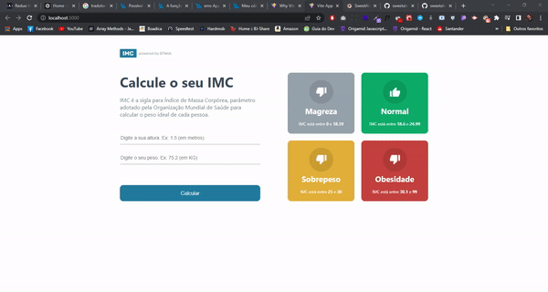

<div align="center" id="top"> 
  

&#xa0;

  <!-- <a href="https://calculadora.netlify.app">Demo</a> -->
</div>

<h1 align="center">BMI Calculator - with React.js and Typescript</h1>

<p align="center">
  

  

  

  

  <!--  -->

  <!--  -->

  <!--  -->
</p>

<!-- Status -->

<!-- <h4 align="center">
	🚧  Calculadora 🚀 Under construction...  🚧
</h4>

<hr> -->

<p align="center">
  <a href="#dart-about">About</a> &#xa0; | &#xa0; 
  <a href="#sparkles-features">Features</a> &#xa0; | &#xa0;
  <a href="#rocket-technologies">Technologies</a> &#xa0; | &#xa0;
  <a href="#white_check_mark-requirements">Requirements</a> &#xa0; | &#xa0;
  <a href="#checkered_flag-starting">Starting</a> &#xa0; | &#xa0;
  <a href="#memo-license">License</a> &#xa0; | &#xa0;
  <a href="https://github.com/{{YOUR_GITHUB_USERNAME}}" target="_blank">Author</a>
</p>

<br>

## :dart: About

Project made to deepen my knowledge in both React.js and Typescript

## :rocket: Technologies

The following tools were used in this project:

- [React](https://pt-br.reactjs.org/)
- [TypeScript](https://www.typescriptlang.org/)
- [Vite](https://vitejs.dev/guide/)

## :white_check_mark: Requirements

Before starting, you'll need to have the following tools installed on your machine:
[Git](https://git-scm.com), [Node.js](https://nodejs.org/en/), [Yarn](https://classic.yarnpkg.com/en/docs/install#windows-stable).
Also it's nice to have an editor to work with the code like [VSCode](https://code.visualstudio.com/)

## :checkered_flag: Starting

```bash
# Clone this project
$ git clone https://github.com/renatoknot/BMI-Calculator-ReactJs.git

# Access
$ cd BMI-Calculator-ReactJs

# Install dependencies
$ yarn

# Run the project
$ yarn start

# The server will initialize in the <http://localhost:3000>
```

## :memo: License

This project is under license from MIT. For more details, see the [LICENSE](LICENSE.md) file.

Made with :heart: by <a href="https://github.com/renatoknot" target="_blank">Renato</a>

&#xa0;

<a href="#top">Back to top</a>
